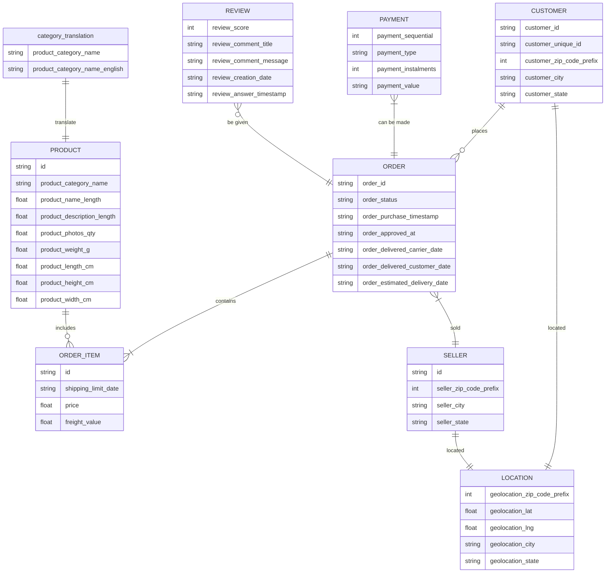

# Customer 360 

---
## Data Loading and Initial Exploration

### Customer

- 99441 entries

- schema:
  | column                   | dtype  | null value present | Remarks                                    |
  | ------------------------ | ------ | ------------------ | ------------------------------------------ |
  | customer_id              | string | no                 |                                            |
  | customer_unique_id       | string | no                 | Can be used in identifying repeat customer |
  | customer_zip_code_prefix | int    | no                 |                                            |
  | customer_city            | string | no                 |                                            |
  | customer_state           | string | no                 |                                            |

- No null values present 

### Orders

- 99441 entries
- schema 
  | column                        | dtype  | null value present | Remarks                                                      |
  | ----------------------------- | ------ | ------------------ | ------------------------------------------------------------ |
  | order_id                      | string | no                 | PK                                                           |
  | customer_id                   | string | no                 | FK                                                           |
  | order_status                  | string | no                 |                                                              |
  | order_purchase_timestamp      | string | no                 |                                                              |
  | order_approved_at             | string | yes                | Null is present for delivered, creates status as well. this can be ignored |
  | order_delivered_carrier_date  | string | yes                | Null value present can be ignored only two entries are missing and we can safely drop these values |
  | order_delivered_customer_date | string | yes                | There are 9 missing entries we can delete this data even if the status is delivered date is not present this is and incomplete data entry. |
  | order_estimated_delivery_date | string | no                 |                                                              |

- Cleaning required 
  - Order status upper case
  - drop na for order_delivered_carrier_date and order_delivered_customer_date

### Order item

- 112650 entries

- Schema
  | column                        | dtype  | null value present | Remarks                                                      |
  | ------------------- | ------- | ---- | ---- |
  | order_id            | string  | no | FK |
  | order_item_id       | int64   | no | PK |
  | product_id          | string  | no | FK |
  | seller_id           | string  | no | FK |
  | shipping_limit_date | string  | no |      |
  | price               | float64 | no |      |
  | freight_value | float64 | no | |

- No null value present

### Payment

- 103886 entries

- Schema
  | column               | dtype  | null value present | Remarks                 |
  | -------------------- | ------ | ------------------ | ----------------------- |
  | order_id             | string | no                 | FK                      |
  | payment_sequential   | int64  | no                 | instalment no           |
  | payment_type         | string | no                 |                         |
  | payment_installments | int64  | no                 | No of instalments opted |
  | payment_value        | string | no                 |                         |

### Review

- 99224 entries


| column               | dtype  | null value present | Remarks                 |
| -------------------- | ------ | ------------------ | ----------------------- |
| order_id                | string | no   | FK |
| review_score            | int64  | no   |      |
| review_comment_title    | string | yes  |      |
| review_comment_message  | string | yes  |      |
| review_creation_date    | string | no   |      |
| review_answer_timestamp | string | no   |      |


### Secondary table

#### products

- There are some missing product category name we can replace NAN it with Miscellaneous

- columns and dtype
  | column | dtype |
  | -------------------------- | ------- |
  | product_id                 | object  |
  | product_category_name      | object  |
  | product_name_lenght        | float64 |
  | product_description_lenght | float64 |
  | product_photos_qty         | float64 |
  | product_weight_g           | float64 |
  | product_length_cm          | float64 |
  | product_height_cm          | float64 |
  | product_width_cm           | float64 |

#### sellers, location, and category_translation

- No null value present in all three 


### ER diagram 




## Data Cleaning and Preprocessing

- Remove duplicate records from all the table
- order_delivered_carrier_date and order_delivered_customer_date:  Null value present can be ignored as they are incomplete data
- handling missing values of product_category_name in product table by replacing null by "Miscellaneous"
- Convert date columns to datetime format 
  - orders table
    - "order_purchase_timestamp"
    -  "order_approved_at"
    - "order_delivered_carrier_date"
    -  "order_delivered_customer_date"
    - "order_estimated_delivery_date" 

  - order_item
    - shipping_limit_date


## Data Integration (Critical Component)

1.  products + category_translation  ==>    products_f 

2.  order_items + products_f             ==>    order_item_1

4.  order_items_1 + sellers                 ==>    order_item_f

6.  orders + order_items _f                 ==>   orders_1                   

7.  orders_1 + customers                    ==>   orders_2                   

8.  orders_2 + payments                      ==>   orders_3

9.  orders_3+ reviews                           ==>   fact


## Feature Engineering

### 1. Core Transactional (RFM) Features

*Source: `order_id`, `order_purchase_timestamp`, `payment_value`*

- **Recency:** `Current_Date - max(order_purchase_timestamp)`. (How fresh is the customer?)
- **Frequency:** `count(distinct order_id)`. (How loyal are they?)
- **Monetary (LTV):** `sum(payment_value)`. (How valuable are they?)
- **Average Ticket Size:** `sum(payment_value) / count(distinct order_id)`.

### 2. Logistic & Experience Features

*Source: `order_delivered_customer_date`, `order_estimated_delivery_date`, `review_score`*

- **Delivery Delay:** `order_delivered_customer_date - order_estimated_delivery_date`. (Positive values indicate late deliveries, a primary churn driver).
- **Average Review Score:** `mean(review_score)`. (A direct proxy for customer satisfaction).
- **Review Propensity:** `count(review_id) / count(order_id)`. (Does this customer engage with the feedback loop?).
- **Freight Ratio:** `sum(freight_value) / sum(payment_value)`. (High ratios often lead to cart abandonment in the future).

## 3. Product & Diversity Features

*Source: `product_category_name_english`, `product_id`, `payment_type`*

- **Category Affinity:** The `mode` or most frequent `product_category_name_english`.
- **Breadth of Interest:** `count(distinct product_category_name_english)`. (Does the customer only buy electronics, or do they explore?).
- **Installment User:** `mean(payment_installments)`. (High installments often indicate high-value, price-sensitive shoppers).
- **Preferred Payment Method:** `mode(payment_type)`. (Credit card vs. boleto/voucher).

------

### 4. Geographic & Seller Relationship

*Source: `customer_state`, `seller_id`, `product_weight_g`*

- 
- **Seller Loyalty:** `count(distinct seller_id) / count(order_id)`. (A low ratio means they keep returning to the same sellers).
- **Heavy Goods Buyer:** `mean(product_weight_g)`. (Useful for shipping-related promotions).

## Exploratory Data Analysis (EDA)

Perform structured analysis across the following dimensions:

```
'order_id', 'customer_id', 'order_status', 'order_purchase_timestamp',
'order_approved_at', 'order_delivered_carrier_date',
'order_delivered_customer_date', 'order_estimated_delivery_date',
'order_item_id', 'product_id', 'seller_id', 'shipping_limit_date',
'price', 'freight_value', 'product_category_name',
'product_name_lenght', 'product_description_lenght',
'product_photos_qty', 'product_weight_g', 'product_length_cm',
'product_height_cm', 'product_width_cm',
'product_category_name_english', 'seller_zip_code_prefix',
'seller_city', 'seller_state', 'customer_unique_id',
'customer_zip_code_prefix', 'customer_city', 'customer_state',
'payment_sequential', 'payment_type', 'payment_installments',
'payment_value', 'review_id', 'review_score', 'review_comment_title',
'review_comment_message', 'review_creation_date',
'review_answer_timestamp'
```


#### Customer Analysis

- New vs repeat customers 
- High-value vs low-value customers 
- Geographic distribution of customers 

#### Revenue and Order Analysis

- Monthly revenue trends 
- Order volume trends 
- Peak sales periods 

#### Product Analysis

- Top-selling product categories 
- Revenue contribution by category 
- Product demand distribution 

#### Seller Analysis

- Top-performing sellers 
- Seller contribution to revenue 
- Seller distribution 

#### Review and Satisfaction Analysis

- Distribution of review scores 
- Relationship between delivery time and ratings 
- Identification of dissatisfaction patterns 


## Data Visualization

Use Matplotlib and Seaborn to create:

- Time series plots (sales trends) 
- Bar charts (category performance) 
- Histograms (distribution analysis) 
- Box plots (outlier detection) 
- Heatmaps (correlation analysis) 

All visualizations must be clearly labeled and interpretable.
